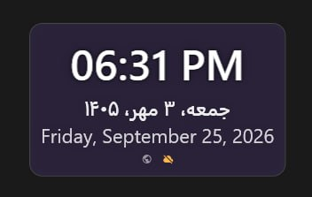

<div align="center">

# 🕐 DateTime Widget for Windows

**A lightweight, always-on-top Windows desktop widget that shows time and date in Gregorian and Persian (Jalali) calendars — synced with an online time API and beautifully themed with Material Design.**

[](https://dotnet.microsoft.com/)
[](https://learn.microsoft.com/dotnet/desktop/wpf/)
[](http://materialdesigninxaml.net/)
[](https://xunit.net/)
[](LICENSE)

</div>

---

## ✨ Features

- 🗓️ **Dual calendar support** — Gregorian and Persian (Jalali) dates, with Persian digit rendering
- 🌍 **Multi-timezone** — pick any system timezone; the widget recalculates automatically
- ☁️ **Online time sync** — pulls accurate time from [timeapi.io](https://timeapi.io/) with retry + circuit-breaker resilience (Polly)
- 🕒 **Configurable format** — 12/24-hour, optional seconds, optional date row
- 🎨 **Customizable appearance** — Material Design color picker, opacity slider, three widget sizes
- 🖱️ **Draggable, always-on-top window** — right-click for settings, hover for close
- 💾 **Persistent settings** — window position, color, size, language, timezone saved automatically
- 🌐 **Bilingual UI** — English and Persian (RTL-aware) rendering
- 🧪 **Comprehensive unit test suite** — Services, ViewModels, Converters covered with xUnit + Moq + FluentAssertions

---

## 📸 Preview



## 🏗️ Architecture

The application follows a clean **MVVM** structure with dependency injection, background hosted services, and a service abstraction layer.

```
WindowsTimeWidget/
├── Abstractions/           Interfaces (ITimeService, ISettingsService, ITimeSyncService)
├── Models/                 Domain models (WidgetSettings, WidgetLanguage, WidgetSize, TimeApiResponse)
├── Services/
│   ├── DateFormatter.cs            Gregorian + Persian formatting, digit conversion
│   ├── SettingsService.cs          JSON persistence under %APPDATA%
│   ├── TimeService.cs              API sync + system-time fallback + drift projection
│   └── BackgroundServices/
│       ├── TimeSyncService.cs      IHostedService, periodic + triggered re-sync
│       ├── TimeSyncOptions.cs      Configuration binding
│       └── ServiceCollectionExtensions.cs
├── ViewModels/
│   ├── ViewModelBase.cs            INotifyPropertyChanged base
│   ├── RelayCommand.cs             ICommand implementation
│   ├── MainViewModel.cs            Drives the widget window
│   └── SettingsViewModel.cs        Drives the settings window
├── Views/
│   ├── Converters/
│   │   ├── BoolToFlowDirectionConverter.cs
│   │   ├── ColorToHexConverter.cs
│   │   ├── EnumToBoolConverter.cs
│   │   └── HexToBrushConverter.cs
│   ├── UserControls/
│   │   └── DateTimeDisplay.xaml    The visual content of the widget
│   └── Windows/
│       ├── MainWindow.xaml         Frameless, draggable, always-on-top widget
│       └── SettingsWindow.xaml     Material Design settings dialog
├── App.xaml / App.xaml.cs          Host builder, DI, HTTP client, Polly policies
└── appsettings.json                TimeSync configuration
```

### Design principles

- **Dependency injection everywhere** — `Microsoft.Extensions.Hosting` drives the app lifecycle
- **Interfaces over concretes** — every service has an `I*` abstraction, making the ViewModels unit-testable
- **Resilience by default** — HTTP calls go through Polly retry + circuit-breaker policies
- **Non-blocking UI** — time sync runs on a `BackgroundService`; the UI just reads projected time
- **Culture-invariant formatting** — `DateFormatter` uses explicit `en-US` and `PersianCalendar`, independent of the host culture

---

## 🚀 Getting Started

### Prerequisites

- **Windows 10 / 11**
- **.NET 10 SDK** (with the Windows Desktop workload)
- Internet connection for time sync (the widget falls back to system time if offline)

### Build & Run

```bash
git clone https://github.com/<your-username>/DateTimeWidget.git
cd DateTimeWidget
dotnet restore
dotnet run --project WindowsTimeWidget
```

### Run the tests

```bash
dotnet test
```

Or filter by module:

```bash
dotnet test --filter "Module~Services"
dotnet test --filter "Module~ViewModels"
dotnet test --filter "Module~Views.Converters"
dotnet test --filter "Module~Views.UserControls"
```

---

## ⚙️ Configuration

Time sync behavior is controlled via `appsettings.json`:

```json
{
  "TimeSync": {
    "SyncInterval": "00:05:00",
    "StartupDelay": "00:00:03"
  }
}
```

| Key | Default | Description |
|-----|---------|-------------|
| `TimeSync:SyncInterval` | `00:05:00` | How often to re-sync with the API |
| `TimeSync:StartupDelay` | `00:00:03` | Delay before the first sync after app start |

### User settings

Persisted at:

```
%APPDATA%\Mohaasaan\DateTimeWidget\settings.json
```

Contains timezone, color, size, opacity, language, format flags, and window position.

---

## 🎮 Usage

| Action | Result |
|--------|--------|
| **Left-click + drag** | Move the widget |
| **Right-click** | Open the settings window |
| **Hover top-right corner** | Reveal the close button |
| **Change timezone in settings** | Widget re-syncs immediately |
| **Change language to Persian** | Dates render RTL with Persian digits |

---

## 🧪 Testing

The project ships with a comprehensive xUnit test suite organized by **module** to mirror the application structure.

### Stack

- **xUnit** — test framework
- **Moq** + **Moq.Contrib.HttpClient** — mock `ISettingsService`, `ITimeService`, and `HttpMessageHandler`
- **FluentAssertions** — readable assertion syntax

### Coverage areas

| Module | Focus |
|--------|-------|
| `Services.DateFormatter` | Gregorian + Persian formatting, digit conversion, culture invariance |
| `Services.SettingsService` | Persistence, cloning, invalid input, corrupt-file recovery, event raising |
| `Services.TimeService` | API sync success/failure, drift projection, semaphore guard, timezone fallback |
| `Services.BackgroundServices` | Hosted service cadence, option binding, DI registration, exception → system-time fallback |
| `ViewModels.ViewModelBase` | `SetProperty`, `OnPropertyChanged` semantics |
| `ViewModels.RelayCommand` | Execute/CanExecute both overloads, null guards |
| `ViewModels.MainViewModel` | Settings binding, derived properties, timer lifecycle |
| `ViewModels.SettingsViewModel` | Load/save/reset, hex normalization, event propagation, timezone selection |
| `Views.Converters` | All four converters — including round-trip and fallback paths |
| `Views.UserControls.DateTimeDisplay` | Construction smoke test, tree structure, binding propagation, visibility, flow direction |

### Test conventions

- Every test is annotated with `// Arrange`, `// Act`, `// Assert` comments
- WPF-dependent tests run on a dedicated STA thread via a `StaRunner` helper
- Settings-based tests back up and restore `%APPDATA%` to avoid polluting the host
- Assembly-level `DisableTestParallelization` prevents cross-test interference on shared resources

---

## 🛠️ Tech Stack

| Concern | Choice |
|---------|--------|
| Runtime | .NET 10 (`net10.0-windows`) |
| UI | WPF + [MaterialDesignInXamlToolkit](http://materialdesigninxaml.net/) |
| DI / Hosting | `Microsoft.Extensions.Hosting` |
| HTTP | `HttpClient` + `System.Net.Http.Json` |
| Resilience | `Polly` (retry with exponential backoff, circuit breaker) |
| Serialization | `System.Text.Json` |
| Testing | xUnit, Moq, Moq.Contrib.HttpClient, FluentAssertions |

---

## 🤝 Contributing

Contributions are welcome!

1. Fork the repo
2. Create a feature branch: `git checkout -b feature/amazing-thing`
3. Follow the existing style:
   - MVVM — no logic in code-behind
   - Interfaces for every service
   - Unit tests for every ViewModel / Service / Converter change
   - `// Arrange`, `// Act`, `// Assert` comments in tests
4. Run `dotnet test` and make sure everything is green
5. Open a Pull Request

### Areas that would benefit from help

- **UI automation tests** (FlaUI) for the actual window behavior
- **Localization** — currently English + Persian; more languages welcome
- **Additional time providers** — NTP, worldtimeapi.org as fallback sources
- **Tray icon + startup shortcut** support
- **Dark / light theme sync** with the OS

---

## 📄 License

This project is licensed under the **MIT License** — see the [LICENSE](LICENSE) file for details.

---

## 🙏 Acknowledgements

- Time data by [timeapi.io](https://timeapi.io/)
- Icons & styling by [MaterialDesignInXamlToolkit](http://materialdesigninxaml.net/)
- Persian calendar support via `System.Globalization.PersianCalendar`

---

<div align="center">

**Made with ❤️ for the Windows desktop.**

If this project helps you, consider giving it a ⭐

</div>
